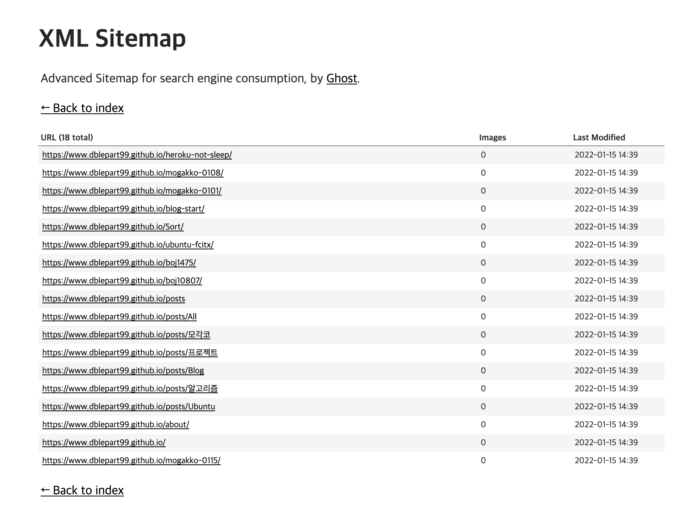

## gatsby 플러그인 설치 명령어

```shell
npm install --save gatsby-plugin-advanced-sitemap
```

gatsby-plugin-advanced-sitemap plugin을 설치하여 쉽게 설정할 수 있다.

## gatsby-config.js 코드 추가

gatsby-config.js에

```javascript
module.exports = {
  siteMetadata: {
    siteUrl: `https://www.example.com`,
  },
  plugins: [`gatsby-plugin-sitemap`],
};
```

위와 같이 코드를 수정하자.

```shell
npm run deploy
```

변경된 사항을 반영해주자.

## Sitemap 생성 결과



[블로그주소]/sitemap-pages.xml 를 접속하면 정상적으로 생성된 sitemap을 확인할 수 있다.

```toc

```
