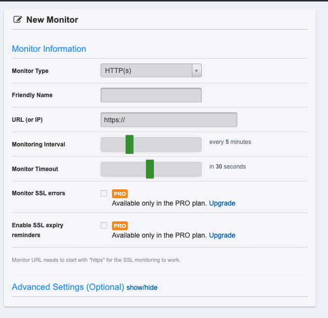

## Heroku 서버

Heroku는 백엔드 서버를 쉽게 만들수 있게 해주는 플랫폼이다. 이번 친구와 함께 하고 있는 설날 맞이 프로젝트를 위해 백엔드 서버는 Heroku를 사용하기로 하였다. Heroku 서버는 일정 시간 동안 접속이 없을 경우 서버가 멈춰버려서 다시 접근할 경우 시간이 더 걸리는 특징이 있다. 이를 방지하기 위해 할 수 있는 두 가지 방법을 소개하겠다.

## 1. node-cron 사용

1. node cron을 설치한다.

```shell
   npm install node-cron --save
```

2. 샘플 코드

```javascript
const http = require('http');
const cron = require('node-cron');

cron.schedule('*/20 23, 0-14 * * *', function () {
  console.log('cron active');
  http.get('http://yourheroku.com');
});
```

위의 스크립트를 추가해주면 된다.

## 2. 모니터링 사이트 이용

[UptimeRobot](https://uptimerobot.com/)라는 사이트이다. 이 사이트는 내가 정해둔 시간마다 내 사이트로 요청을 보내주는 사이트이다.


Friendly name에는 확인하고자 하는 사이트의 약칭을 작성한다. URL을 작성하고, Interval을 통해 시간을 설정할 수 있다.

설정 완료!

## 내가 한 설정

node-cron은 아무래도 http 요청을 보내서 그런 것인지 자꾸 다른 부분에서 오류가 발생해서 우선은 모니터링 사이트를 이용하는 방식으로 해두었다.

```toc

```
